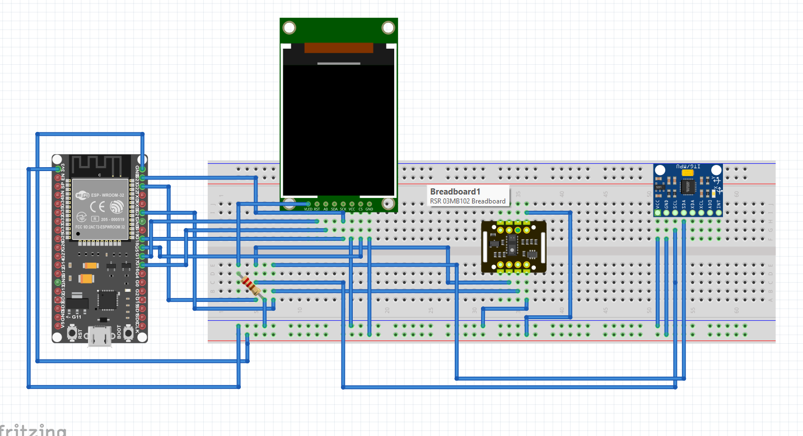
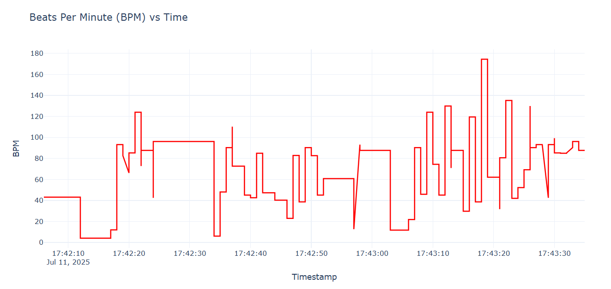
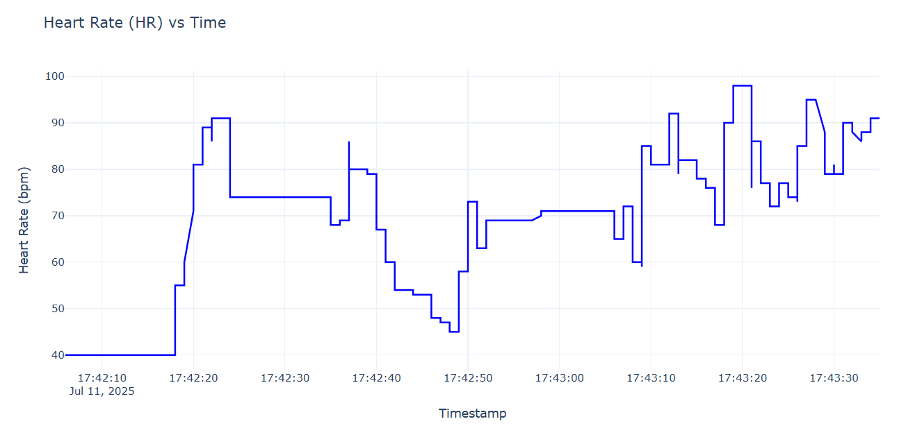

# RemoteVitals: AI-Enhanced Multi-Modal Vitals Monitoring System with Edge Intelligence

##  Project Overview

**RemoteVitals** is a cutting-edge, low-cost remote patient monitoring wearable device combining **PPG**, **SpO2** **temperature**, and **motion sensing** with **Edge AI capabilities**. Designed for rural and telehealth scenarios, the system enables accurate vitals monitoring and **predictive health analytics** using an ESP32 microcontroller.

---

##  Target Application Area

**Remote Patient Monitoring** — for cardiovascular patients, respiratory conditions, post-operative care, and elderly monitoring in low-resource settings.

---

##  Key Innovation Highlights

- **Edge AI:** Real-time signal processing using TinyML on ESP32.
- **Sensor Fusion:** Combines PPG, IMU, and temperature data for accurate readings.
- **Predictive Analytics:** Early detection of arrhythmias, hypoxemia, etc.
- **Adaptive Learning:** Personalized health baselines and anomaly detection.

---

##  Repository Structure

```bash
/ PulseTrack/
│
├── README.md                         # Project summary, setup, goals
│
├── hardware/
│   ├── circuit diagram.png           # Circuit schematic
│   ├── pin mapping.txt               # ESP32 pin configuration
│   └── components list.md            # BOM with part numbers & costs
│
├── firmware/
│   ├── src/
│   │   ├── main.ino                  # ESP32 firmware (Arduino)
│   │   └── model.h                   # TinyML model header file
│   └── platformio.ini               # Optional build system file
│
├── test logs/
│   ├── breathing data.csv           # Sample HR/SpO2 data
│   ├── drift test 24h.csv           # Long-duration testing logs
│   └── screenshots/                 # Plots and monitor outputs
│
└── demo/
    └── demo video.mp4               # <3 min demo walkthrough
```

---

##  Hardware Components

| Component              | Part Number     | Function                         | Cost (INR) |
|------------------------|------------------|----------------------------------|------------|
| PPG/SpO2 Sensor        | MAX30102         | Heart rate, SpO2 monitoring      | ₹150       |
| IMU/Accelerometer      | MPU 6050         | Motion detection, artifact removal | ₹435    |
| Microcontroller        | ESP32-WROOM-32   | Edge AI & WiFi                   | ₹1472      |
| OLED Display (1.8")    | SSD1306          | Visualize vitals in real-time    | ₹450       |
| Power & PCB            | LiPo + Circuitry | Portability & deployment         | ₹300      |

**Total Estimated Cost: ₹4000**

---

## 🔌 Circuit Pin Mapping

| Sensor/Module | ESP32 Pin  | Function               | Protocol |
|---------------|------------|------------------------|----------|
| MAX30102 SDA  | GPIO 21    | I2C Data               | I2C      |
| MAX30102 SCL  | GPIO 22    | I2C Clock              | I2C      |
| MPU6050 SDA   | GPIO 21    | I2C Data (shared)      | I2C      |
| MPU6050 SCL   | GPIO 22    | I2C Clock (shared)     | I2C      |
| OLED CS       | GPIO 5     | X-axis motion          | Analog   |
| OLED RESET    | TX2        | Y-axis motion          | Analog   |
| OLED AO       | RX2        | Z-axis motion          | Analog   |
| OLED SDA      | GPIO 23    | Display Data (shared)  | I2C      |
| OLED SCK      | GPIO 18    | Display Clock (shared) | I2C      |




---


https://drive.google.com/file/d/1tzzq1KoVauxgcrgiYAXC9QIRF261q3CF/view?usp=sharing

---
## Plots of the Results







##  Testing Plan (TRL-8 Compliance)

- ✅ **Accuracy Validation**: ±3 BPM vs commercial oximeters  
- ✅ **Motion Artifact Testing**: Evaluate readings while walking, resting  
- ✅ **Temperature Calibration**: ±0.3°C accuracy vs medical thermometers  
- ✅ **24-Hour Operation**: Battery & consistency test (99% uptime goal)  
- ✅ **Environmental Tolerance**: Tests from -10°C to 50°C  
- ✅ **AI Model Validation**: Synthetic and real-world ECG comparisons  
- ✅ **Field Trials**: 48-hour test with multiple subjects  

---

##  Indian Sensor Substitution Plan

- Modular I2C/SPI sensor abstraction layers  
- Firmware calibration routines for sensor variability  
- PCB design supports pin-compatible Indian alternatives  
- Backward-compatible firmware updates for new hardware  
- Explore partnerships with Indian sensor manufacturers  

---

##  Edge AI & ML Features

### Frameworks Used:

- `TensorFlow Lite Micro`  
- `Arduino` + `C++` for real-time tasks  

### Capabilities:

- **FFT-based Filtering**: Noise & motion artifact removal  
- **Kalman Filter**: Sensor data fusion  
- **LSTM Models**: Predictive health analytics  
- **Isolation Forests**: Anomaly detection  

### Personalized Health Monitoring:

- Adaptive baselines per user  
- AI-enhanced motion compensation  
- Context-aware sensor tuning (e.g., sleep vs active)  
- Health risk scoring and trend alerts  

---

## 📹 Demo

> A short demo video (under 3 minutes) is provided in the `demo/` folder showing device functionality, vitals output, and real-time alerts.

---

## Conclusion


##  Team

| Name             | Role                          | Email                          |
|------------------|-------------------------------|--------------------------------|
| Dikshit Singla   | Team Lead                     | dikshit131105@gmail.com        |
| Ravindra Sidda   | Hardware Integration Specialist | ravindrasidda0s@gmail.com     |
| Ankur Gupta      | Software & Testing Engineer   | ankur2115gupta29@gmail.com     |

---

##  Acknowledgement

I would like to extend my sincere gratitude to the ELCIA Committee, the International Institute of Information Technology Bangalore (IIITB), and Kunal Ghosh for providing us with the invaluable opportunity to participate in this hackathon.

Their support and guidance have been instrumental in the development of my project, and their commitment to fostering innovation and creativity is truly commendable. We are deeply thankful for the platform they have created, which has allowed us to explore out ideas, enhance our skills, and contribute to a meaningful cause.

Thank you for this exceptional opportunity.

---

> Made with ❤️ by Team **HardWeared**, IIT Bombay
