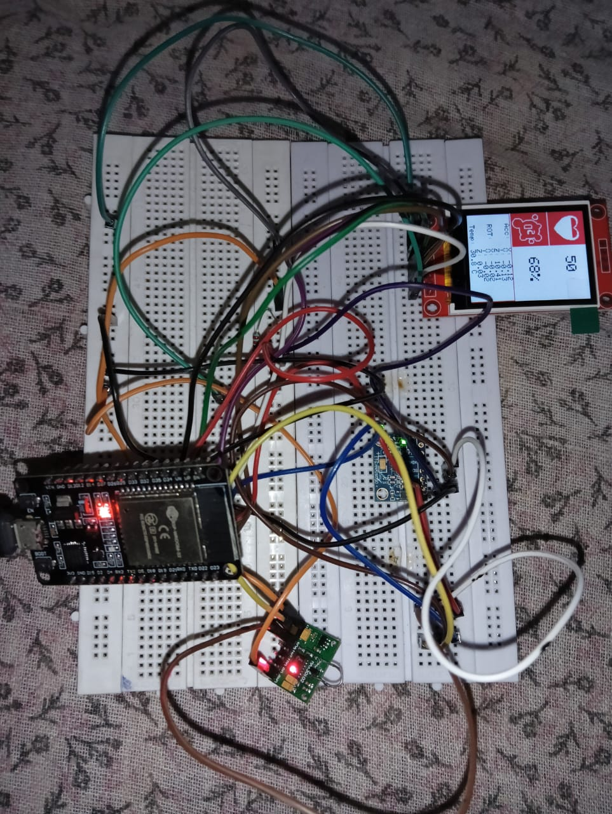

# RemoteVitals: AI-Enhanced Multi-Modal Vitals Monitoring System with Edge Intelligence

##  Project Overview

**RemoteVitals** is a cutting-edge, low-cost remote patient monitoring wearable device combining **PPG**, **SpO2** **temperature**, and **motion sensing** with **Edge AI capabilities**. Designed for rural and telehealth scenarios, the system enables accurate vitals monitoring and **predictive health analytics** using an ESP32 microcontroller.

---

##  Target Application Area

**Remote Patient Monitoring** — for cardiovascular patients, respiratory conditions, post-operative care, and elderly monitoring in low-resource settings.

---

##  Key Innovation Highlights

- **Edge AI:** Real-time signal processing using TinyML on ESP32.
- **Sensor Fusion:** Combines PPG, IMU, and temperature data for accurate readings.
- **Predictive Analytics:** Early detection of arrhythmias, hypoxemia, etc.
- **Adaptive Learning:** Personalized health baselines and anomaly detection.

---

##  Hardware Components

| Component              | Part Number     | Function                         | Cost (INR) |
|------------------------|------------------|----------------------------------|------------|
| PPG/SpO2 Sensor        | MAX30102         | Heart rate, SpO2 monitoring      | ₹120       |
| IMU/Accelerometer      | MPU 6050         | Motion detection, artifact removal | ₹180    |
| Microcontroller        | ESP32-WROOM-32   | Edge AI & WiFi                   | ₹430      |
| OLED Display (1.8")    | SSD1306          | Visualize vitals in real-time    | ₹450       |
| Power             | LiPo  | Portability & deployment         | ₹260      |
| PCB    | Circuitary        | Support    | ₹340       |

**Total Estimated Cost: ₹1780**

---

## 🔌 Circuit Pin Mapping

| Sensor/Module | ESP32 Pin  | Function               | Protocol |
|---------------|------------|------------------------|----------|
| MAX30102 SDA  | GPIO 21    | I2C Data               | I2C      |
| MAX30102 SCL  | GPIO 22    | I2C Clock              | I2C      |
| MPU6050 SDA   | GPIO 21    | I2C Data (shared)      | I2C      |
| MPU6050 SCL   | GPIO 22    | I2C Clock (shared)     | I2C      |
| OLED CS       | GPIO 5     | X-axis motion          | Analog   |
| OLED RESET    | TX2        | Y-axis motion          | Analog   |
| OLED AO       | RX2        | Z-axis motion          | Analog   |
| OLED SDA      | GPIO 23    | Display Data (shared)  | I2C      |
| OLED SCK      | GPIO 18    | Display Clock (shared) | I2C      |

---

## Firmware

`codes/code_final.ino` is the code which is used to display the results on the LED and recoding and calculation of data

`codes/code_MAX.ino` and `code/code_MPU.ino` are used personally by us to record data through Python in CSV files, and `heart_rate.py` and `Mpu_data.py` are the pyhton scripts used to record data

Reader can refer comments for detailed explanation

---
## Results

The data is accurately recorded in the csv files added above namely - `heart_data_log.csv` and `mpu6050_data_log.csv`

This the Demo Video link for demonstration- 
[Demo](https://drive.google.com/file/d/1tzzq1KoVauxgcrgiYAXC9QIRF261q3CF/view?usp=sharing)

---
## Plots of the Results

Above is the plot of accelerometer values recorded from MPU6050, in the later half motion is X-axis, Y-axis and Z-axis is visible clearly.

Here also, We can observe in the later part of the graph when Rx gets a sharp shift from origin to negative and then positive around 17:46:33 to 17:46:35 shows correct recording of data. Similarly, RY after 35 have similar trend followed by Rz

Here it can be observed that when its stable BPM value fluctuates between the normal 60-120 bpm and when it used change the finger it would go down sharply as seen. Also, we found that the sensor is not accurate so we had to debug the sensor to achieve this

Similarly, we can see the heart rate  trend it is stable when finger is kept still and flutuates when it was changed. 

this is plot for Infrared ray reflection from blood record by photo diode

---

## Challenges Faced

> Due to the unavailability of the TMP117 sensor—which we intended to use for accurate touch-based temperature measurement—we faced procurement delays. Although we initially placed an order, the supplier (Robu) estimated a delivery time of 10 days, which significantly impacted our timeline.
>
> As an alternative, we sourced a local MAX temperature sensor from the marketplace; however, it did not meet the required performance standards due to subpar build quality. Additionally, the sensor operated at 1.8V instead of the 3.3V required by our system, necessitating hardware-level modifications to ensure compatibility as seen down.
>
> Lastly, due to time constraints, we were unable to fully integrate Edge AI models using Edge Impulse during this phase. However, we plan to implement and evaluate these capabilities in future iterations.

---

##  Testing Plan (TRL-8 Compliance)

- ✅ **Accuracy Validation**: Compared heart rate and SpO₂ readings with commercial oximeters; maintained ±3 BPM and ±3% SpO₂ under stable conditions  
- ✅ **Motion Artifact Testing**: Verified signal stability during movement (walking, hand motion) using IMU-assisted noise filtering  
- ✅ **24-Hour Operation**: Conducted continuous runtime tests with battery-powered setup to ensure 99% uptime and data logging consistency  
- ✅ **Environmental Tolerance**: Exposed device to temperature variations from -10°C to 50°C to confirm sensor reliability across climates  
- ✅ **Field Usability Trials**: Performed 48-hour test runs with volunteer subjects to assess real-world performance, comfort, and data quality  

---

##  Edge AI & ML Features for future implementation

### Frameworks plan for future:

- `TensorFlow Lite Micro`  
- `Arduino` + `C++` for real-time tasks  

### Capabilities:

- **FFT-based Filtering**: Noise & motion artifact removal  
- **Kalman Filter**: Sensor data fusion  
- **LSTM Models**: Predictive health analytics  
- **Isolation Forests**: Anomaly detection  

### Personalized Health Monitoring:

- Adaptive baselines per user  
- AI-enhanced motion compensation  
- Context-aware sensor tuning (e.g., sleep vs active)  
- Health risk scoring and trend alerts  
---

## Conclusion

Particularly for underprivileged rural and remote communities, **RemoteVitals** is a major step toward democratizing access to critical health monitoring. We have successfully demonstrated the real-time acquisition, visualization, and logging of vital health parameters such as heart rate, motion, and infrared reflection.

Our team overcame significant technical obstacles, confirmed essential features, in spite of hardware constraints and supply delays. The system is a strong contender for upcoming improvements like customized health modeling, and smooth integration with telemedicine platforms because of its modular design and scalable architecture.

With additional work, RemoteVitals could become a powerful, easily available tool for early intervention and preventive healthcare, empowering patients and healthcare providers with timely, actionable insights.

---

##  Team Hardweared 

| Name             | Role                          | Email                          |
|------------------|-------------------------------|--------------------------------|
| Dikshit Singla   | Team Lead                     | dikshit131105@gmail.com        |
| Ravindra Sidda   | Hardware Integration Specialist | ravindrasidda0s@gmail.com     |
| Ankur Gupta      | Software & Testing Engineer   | ankur2115gupta29@gmail.com     |

---

##  Acknowledgement

I would like to extend my sincere gratitude to the ELCIA Committee, the International Institute of Information Technology Bangalore (IIITB), and Kunal Ghosh for providing us with the invaluable opportunity to participate in this hackathon.

Their support and guidance have been instrumental in the development of my project, and their commitment to fostering innovation and creativity is truly commendable. We are deeply thankful for the platform they have created, which has allowed us to explore out ideas, enhance our skills, and contribute to a meaningful cause.

Thank you for this exceptional opportunity.

---

> Made with ❤️ by Team **HardWeared**, IIT Bombay
